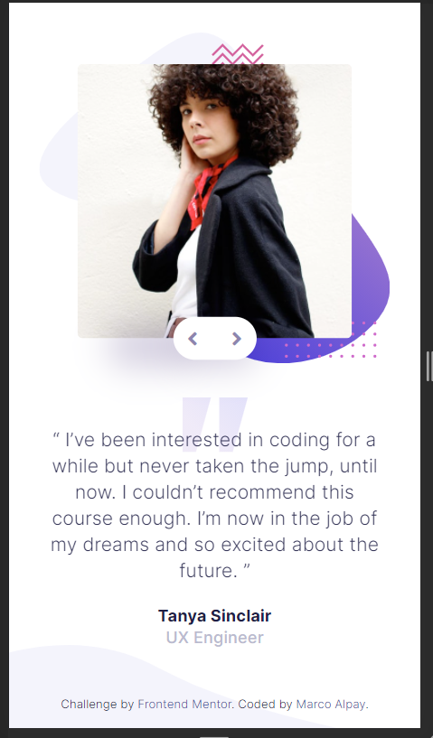

# Frontend Mentor - Coding bootcamp testimonials slider solution

This is a solution to the [Coding bootcamp testimonials slider challenge on Frontend Mentor](https://www.frontendmentor.io/challenges/coding-bootcamp-testimonials-slider-4FNyLA8JL). Frontend Mentor challenges help you improve your coding skills by building realistic projects.

## Table of contents

- [Overview](#overview)
  - [The challenge](#the-challenge)
  - [Screenshot](#screenshot)
  - [Links](#links)
- [My process](#my-process)
  - [Built with](#built-with)
  - [What I learned](#what-i-learned)
- [Author](#author)

## Overview

### The challenge

Users should be able to:

- View the optimal layout for the component depending on their device's screen size
- Navigate the slider using either their mouse/trackpad or keyboard

### Screenshot




### Links

- Solution URL: [https://www.frontendmentor.io/solutions/coding-bootcamp-testimonials-slider-using-sass-and-javascript-oHZcKbJEp](https://www.frontendmentor.io/solutions/coding-bootcamp-testimonials-slider-using-sass-and-javascript-oHZcKbJEp)
- Live Site URL: [https://devmarco02-coding-bootcamp-testimonials-slider.netlify.app/](https://devmarco02-coding-bootcamp-testimonials-slider.netlify.app/)

## My process

### Built with

- Semantic HTML5 markup
- Sass
- JavaScript
- BEM methodology
- Mobile-first workflow

### What I learned

I have learned how to use Keyboard Events to create a keyboard shortcut.

```js
  const leftRight = (e) => {
    if (e.keyCode == 39) {
      if (!slides.classList.contains("testimonial__slides--active")) {
        slides.classList.add("testimonial__slides--active");
      }
    }

    if (e.keyCode == 37) {
      if (slides.classList.contains("testimonial__slides--active")) {
        slides.classList.remove("testimonial__slides--active");
      }
    }
  };
};
```

## Author

- Frontend Mentor - [@devMarco02](https://www.frontendmentor.io/profile/devMarco02)
